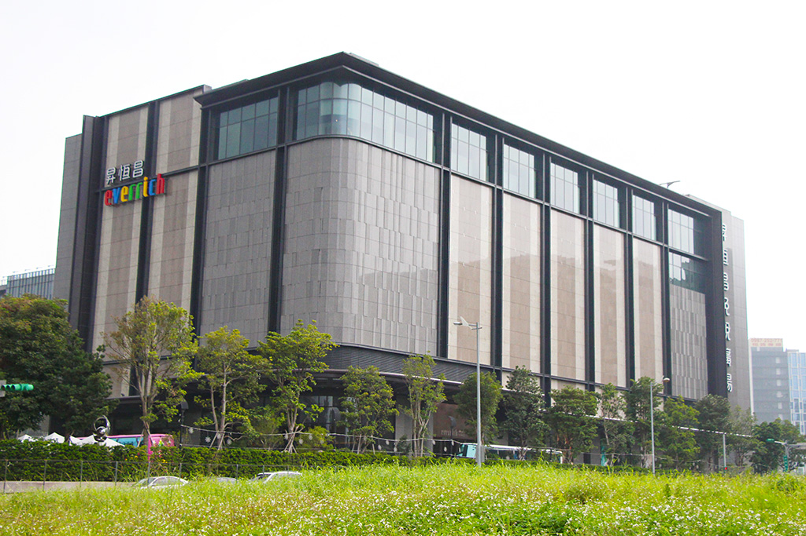
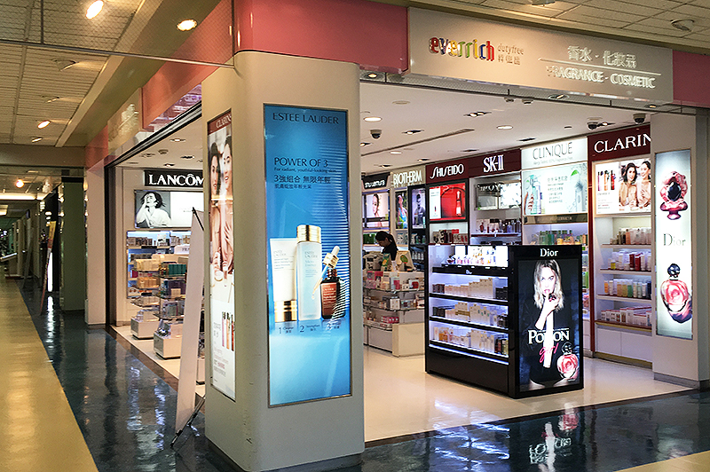
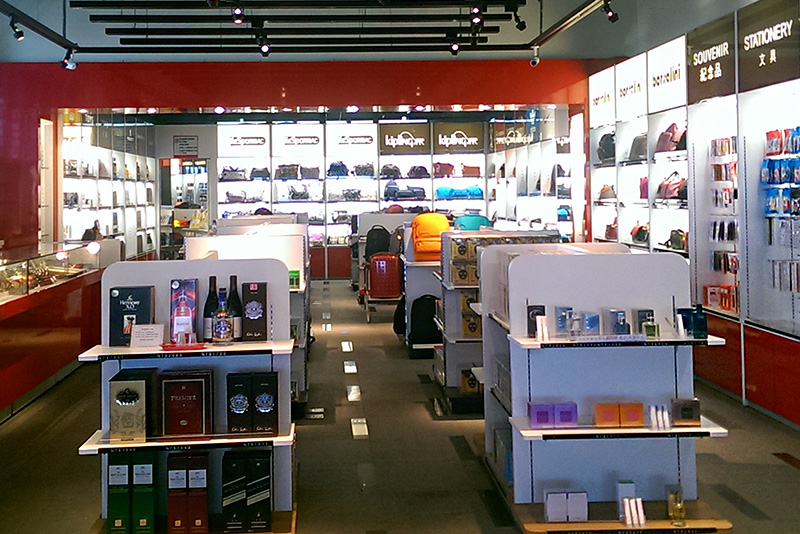

## 台湾免税店

免税店除了在各机场之外，市区更有大规模旗舰店」，以宽敞舒适的购物空间，让消费者从容自在的购物-市区预购、机场提货，增加服务便利性。

### 昇恒昌免税店(市区预购店)

昇恒昌免税店除了在各机场设有免税店之外，更在市区以旗舰店规模打造「昇恒昌免税广场」，以宽敞舒适的购物空间，让消费者更从容自在的购物，并以市区预购、机场提货的口号，使服务更臻完善。

 **可购买品项** | **精品、珠宝、美妆、酒类、食品、3C数位、休闲、地方特色商品、独家商品** 
-----------|----------------------------------------
 联络地址      | 请查询官方网站                                
 店家分布      | 台北市：内湖店\(昇恒昌免税广场\)、民权店 桃园县：桃园店 金门：金湖广场 
 联络电话      | 台北市区：0800\-098\-668                    
 营业时间      | 各店营业时间不同，请查询官方网站                       
 官方网站      | http://www\.everrich\.com\.tw          
 交通资讯      | 详细交通资讯，请查询网站。                          

### 昇恒昌免税店(机场免税店)

昇恒昌免税店在台湾多处机场及港口提供免税品的贩售服务，近年来昇恒昌多角化经营，商品丰富多元，服务不断创新，也在机场跨足餐饮业，全方位服务游客。

| 可购买品项 | 精品、珠宝、美妆、酒类、食品、3C数位、休闲、地方特色商品、独家商品                                                                                   |
|-------|----------------------------------------------------------------------------------------------------------------------|
| 联络地址  | 请查询网站                                                                                                                |
| 店家分布  | 松山机场、桃园机场第一、第二航厦、台中机场、高雄机场、花莲机场、金门机场及基隆港，请查询官方网站                                                                     |
| 联络电话  | 松山机场顾客专线：0800-098-668 桃园机场专线：0800-055-556 高雄机场专线：0800-805-885 台中机场专线：886-4-2615-5333 金门水头商港专线：0800-818-568 |
| 营业时间  | 各店营业时间不同，请查询网站。                                                                                                      |
| 官方网站  | http://www.everrich.com.tw                                                                                           |
| 交通资讯  | 详细交通资讯，请查询网站。                                                                                                        |

### 采盟免税店

采盟免税店于桃园机场与马祖南竿机场皆设有免税商店服务，商品丰富多元，服务不断创新，提供国内外旅客免税商品购买与咨询服务。

| 可购买品项 | 精品、珠宝、美妆、酒类、食品、3C数位、休闲、地方特色商品、独家商品                                                                                   |
|-------|----------------------------------------------------------------------------------------------------------------------|
| 联络地址  | 请查询网站                                                                                                                |
| 店家分布  | 松山机场、桃园机场第一、第二航厦、台中机场、高雄机场、花莲机场、金门机场及基隆港，请查询官方网站                                                                     |
| 联络电话  | 松山机场顾客专线：0800-098-668 桃园机场专线：0800-055-556 高雄机场专线：0800-805-885 台中机场专线：886-4-2615-5333 金门水头商港专线：0800-818-568 |
| 营业时间  | 各店营业时间不同，请查询网站。                                                                                                      |
| 官方网站  | http://www.everrich.com.tw                                                                                           |
| 交通资讯  | 详细交通资讯，请查询网站。                                                                                                        |
