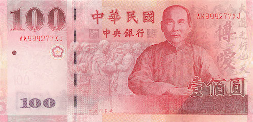
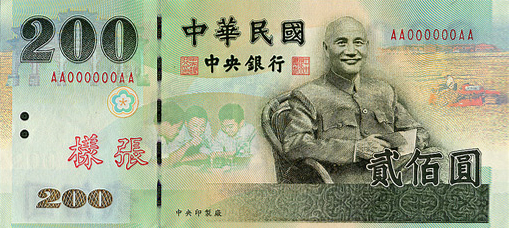
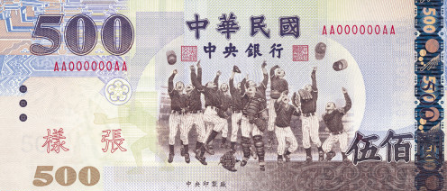
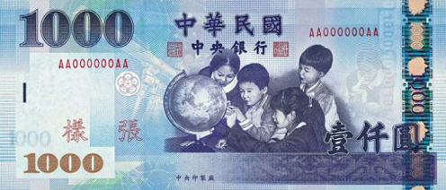
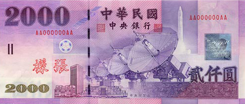

## 台湾流通货币介绍

1. 台湾的流通货币为新台币(NT$)
2. 新台币的纸钞分成：2000元、1000元、500元、200元、及100元。
3. 新台币的硬币分成：50元、20元、10元、5元、及1元。
4. 百货公司及中大型商店均可接受国际流通的信用卡及银联卡消费，各机场、旅馆、重要景点及外汇指定银行也提供外币兑换服务。
5. 「银联卡」可在全台多数银行的提款机（ATM）使用，单次提领金额为新台币20,000元，单日提款金额上限为等值人民币10,000元。

    <h3>  NT$100 </h3>

    <h3>  NT$200 </h3>

    <h3>  NT$500 </h3>

    <h3>  NT$1000 </h3>

    <h3>  NT$2000 </h3>

## 兑换外币

兑换外币可至政府外汇指定银行或国际观光饭店，兑换时取得的收据须妥善留存， 离境前若要将未用完的新台币换回时，必须出示此收据。

外汇指定银行：

| **银行名称**       | **地址**          | **电话**            |
|----------------|-----------------|-------------------|
| **台北富邦银行**     | 台北市中山北路二段50号    | +886-2-25425656   |
| **永丰商业银行**     | 台北市南京东路三段36号    | +886-2-25063333 |
| **合作金库银行**     | 台北市馆前路77号       | +886-2-23118811 |
| **第一银行**       | 台北市重庆南路一段30号    | +886-2-23481111 |
| **彰化银行**       | 台北市中正区重庆南路一段27号 | +886-2-23617211 |
| **华南银行**       | 台北市中正区重庆南路一段38号 | +886-2-23713111 |
| **国泰世华银行**     | 台北市馆前路65号       | +886-2-23125555 |
| **上海商业储蓄银行**   | 台北市民权东路一段2号     | +886-2-25817111 |
| **兆丰国际商业银行**   | 台北市吉林路100号      | +886-2-25633156 |
| **台湾银行**       | 台北市重庆南路一段120号   | +886-2-23493456 |
| **日商瑞穗实业银行**   | 台北市敦化北路167号2楼   | +886-2-27153911 |
| **美国花旗银行台北分行** | 台北市民生东路三段117-1号 | +886-2-27155931 |

> ※营业时间：周一至周五 09:00~15:30、周六、日暨国定假日休假
