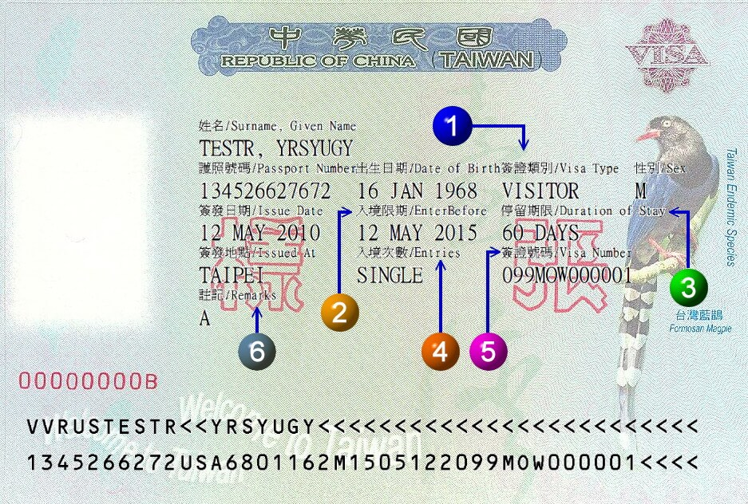

## 台湾签证介绍

签证在意义上为一国之入境许可。依国际法一般原则，国家并无准许外国人入境之义务。目前国际社会中鲜有国家对外国人之入境毫无限制。各国为对来访之外国人能先行审核过滤，确保入境者皆属善意以及外国人所持证照真实有效且不致成为当地社会之负担，乃有签证制度之实施。

>＊依据国际实践，签证之准许或拒发係国家主权行为，故中华民国政府有权拒绝透露拒发签证之原因。

1. 签证类别：中华民国的签证依申请人的入境目的及身分分为四类：

	- 停留签证（VISITOR VISA）：係属短期签证，在台停留期间在180天以内。
	- 居留签证（RESIDENT VISA）：係属于长期签证，在台停留期间为180天以上。
	- 外交签证（DIPLOMATIC VISA）。
	- 礼遇签证（COURTESY VISA）。

2. 入境限期（签证上VALID UNTIL或ENTER BEFORE栏）：係指签证持有人使用该签证之期限，例如VALID UNTIL (或ENTER BEFORE) APRIL 8 ,1999即1999年4月8日后该签证即失效，不得继续使用。
3. 停留期限（DURATION OF STAY）：指签证持有人使用该签证后，自入境之翌日（次日）零时起算，可在台停留之期限。
	- 停留期一般有14天，30天，60天，90天等种类。持停留期限60天以上未加注限制之签证者倘须延长在台停留期限，须于停留期限届满前，检具有关文件向停留地之内政部移民署服务站申请延期。
	- 居留签证不加停留期限：应于入境次日起15日内或在台申获改发居留签证签发日起15日内，向居留地所属之内政部移民署服务站申请外侨居留证（ALIEN RESIDENT CERTIFICATE）及重入国许可(RE-ENTRY PERMIT) ，居留期限则依所持外侨居留证所载效期。

4. 入境次数（ENTRIES）：分为单次（SINGLE）及多次（MULTIPLE）两种。
5. 签证号码（VISA NUMBER）：旅客于入境应于入国登记表填写本栏号码。
6. 注记：指签证申请人申请来台事由或身分之代码，持证人应从事与许可目的相符之活动。(签证注记栏代码表)

详情见：[外交部領事事務局-中華民國簽證介紹](https://www.boca.gov.tw/cp-237-3822-b12d4-1.html)
